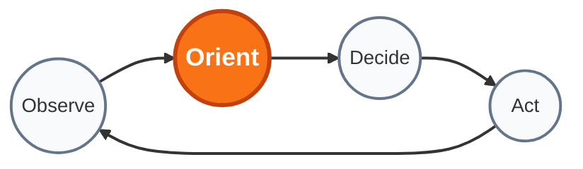

# FOSS-OODA


FOSS-OODA [fɔs ˈuːdə] ist ein Projekt-Vorgehensmodell basierend auf Entwicklungsprinzipien der Free-/Open-Source-Software Szene mit einer Projektsteuerung, die an den Führungsrythmus von Militäreinheiten und Rettungskräften angelehnt ist.

## Motivation  

#### Open Access und Open Science
Schweizer Fachhochschulen und Universitäten haben sich zu Open Science, Open Access und nachvollziehbaren Methoden verpflichtet. Es wäre ein methodischer Widerspruch, in der Lehre auf urheberrechtlich geschützte, markenrechtlich verriegelte Modelle wie PMP (Project Management Institute) oder zertifizierte Scrum-Lizenzprodukte zu pochen, deren Primärquellen hinter Paywalls oder kommerziellen Trainingskursen liegen.
Eine staatliche Bildungsstätte darf nicht als kostenloser Akquise-Kanal für gewinnorientierte Organisationen (PMI Inc., Scrum Alliance) fungieren. Die Vermittlung von Projektsteuerung an einer Hochschule muss auf offenen Standards, reproduzierbaren Artefakten und überprüfbaren Prinzipien basieren, nicht auf dem Auswendiglernen proprietärer Prüfungsfragen.

#### Militärischer Hintergrund
Von General von Moltkes Erkenntnis, dass kein Plan den ersten Feindkontakt überlebt, bis zu John Boyds Auswertung von Luftkämpfen im Koreakrieg hat militärische Führung über Jahrhunderte gelernt, dass zentrale Steuerung bei hoher Latenz und unvollständigem Lagebild ins Desaster führt. Die Antwort darauf war nicht _mehr Bürokratie_, sondern dezentrale Entscheidungsbefugnis vor Ort, klare Absichten (_Commander’s Intent_) und schnellere Orientierungszyklen als der Gegner.

#### Internet
Das Fundament, auf dem heute die gesamte globale Wirtschaft läuft, etwa TCP/IP, Linux, Git, das Web, entstand nicht durch Scrum-Sprints oder Lenkungsausschüsse. Es entstand exakt nach David Clarks IETF-Leitlinie _„We reject: kings, presidents and voting. We believe in: rough consensus and running code“_. Es hat sich gegen alle proprietären, durchgeplanten Gegenentwürfe (wie die bürokratischen ISO/OSI-Protokollstapel) durchgesetzt, weil es robuster war und schneller lernte.

### Neumodische Modelle
Gegenüber Vertretern von SAFe, Scrum oder PMP sind wir argumentativ in einer uneinholbaren Position. Deren Methoden existieren seit vielleicht zwei Jahrzehnten und dienen primär als Geschäftsmodell für Schulungsanbieter. FOSS-OODA beruft sich auf Systemtheorie, Kybernetik, physikalische Realität und Überlebensfähigkeit unter realen Krisenbedingungen.

### Prämisse
FOSS-OODA richtet sich an eigenverantwortlich handelnde Ingenieure mit hoher Selbstorganisation. Scrum basiert auf der tayloristischen Prämisse, dass Entwickler austauschbare Ressourcen sind, die prozedural im Takt geführt und überwacht werden müssen. Diese Annahme scheitert jedoch an der Realität komplexer Softwaresysteme. Das Onboarding von Junior-Entwicklern und Einsteigern verlangsamt bei FOSS-OODA nicht den Kernprozess, sondern erfolgt über isolierte  Einstiegspfade mit entsprechenden Leitplanken.

## Werte 

**Wir schätzen:**

- **Running Code & Telemetrie** mehr als _theoretische Prozessmodelle_
    
- **Asynchrone RFC & ADR** mehr als _synchrone Meeting-Rituale_
    
- **Meritokratie & Roundtable** mehr als _formale Hierarchie_
    
- **Kontinuierlichen Flow & Feedback** mehr als _künstliche Sprint-Batches_
    
- **Skin in the Game** mehr als _prozedurale Verantwortungsdiffusion_
    
_Das heisst: Wir erkennen den Bedarf an Schnittstellen zur Aussenwelt an, priorisieren an der Werkbank jedoch unnachgiebig die linke Seite._

## Phasen
Der FOSS-OODA-Zyklus ist ein kybernetischer Regelkreis zur kontinuierlichen Latenzminimierung. Statt Annahmen über Wochen in starren Sprint-Gefängnissen zu verwalten, schliesst das Modell die Rückkopplungsschleife direkt an der Realität des laufenden Systems. Die vier Phasen bilden das operative Fundament:

- **Observe:** Die Beobachtung stützt sich ausschliesslich auf unbestechliche Telemetrie: Rohdaten, strukturierte Logs, verteilte Traces und reproduzierbare Minimalbeispiele (MREs) – nicht auf gefilterte Statusberichte oder geschönte Ampel-Dashboards.
    
- **Orient:** Das Gravitationszentrum des Zyklus. Rohdaten werden mit der Systemdynamik, den physikalischen Hardwareressourcen und bestehenden Architekturmustern abgeglichen. Ziel ist die Falsifikation theoretischer Annahmen und die Reduktion von Systemkomplexität (_Via Negativa_).
    
- **Decide:** Architekturentscheide fallen über asynchrone RFC-Prozesse. Es gilt das IETF-Prinzip des _Rough Consensus_: Ein Veto ist nur gültig, wenn es durch messbare Daten oder lauffähigen Referenzcode belegt wird. Bei unauflösbarem Patt entscheidet der Maintainer als Stichentscheid.
    
- **Act:** Die Umsetzung erfolgt ohne langlebige Feature-Branches direkt trunk-basiert über kleine, atomare Commits. Jede Änderung muss automatisierte CI-Gates passieren, bevor sie sofort als neuer Systemzustand wirksam wird.




## Tools

FOSS-OODA setzt auf Werkzeuge, die sich scripten und automatisieren lassen:

- **Versionsverwaltung & Forge:** Git mit leichtgewichtiger Oberfläche (Forgejo, Gitea, GitLab oder GitHub). Keine schwerfälligen Enterprise-Plattformen.
    
- **Task Automation:** Einheitliche Ausführungsumgebung lokal wie im CI über ein `Justfile` (oder Makefile). Ein Entwickler muss mit einem einzigen Befehl (`just check`, `just test`, `just build`) den CI-Zustand exakt replizieren können.
    
- **Dokumentation:** Markdown im Repo, statisch generiert (z. B. via Hugo oder Zola), falls Lesbarkeit im Browser nötig ist.
    
- **Observability:** OpenTelemetry als Standard für Tracing und Metriken; Prometheus/Grafana für Dashboards; strukturierte JSON-Logs an Standard-Outputs.

## Artefakte

Alle Artefakte liegen versioniert im selben Repository wie der Code. Gibt es keine Repräsentation im Dateisystem, existiert das Artefakt nicht.

### Architecture Decision Records (ADRs) & RFCs

- **Zweck:** Festhalten von Richtungsentscheiden und architekturellen Leitplanken. Sie ersetzen endlose Lenkungsausschuss-Sitzungen.
    
- **Format:** Flaches Markdown unter `docs/adr/NNNN-titel.md`.
    
- **Aufbau:**
    
    1. **Status:** `Draft` | `Accepted` | `Rejected` | `Superseded by NNNN`.
        
    2. **Kontext:** Das reale Problem, die physikalischen/systemischen Randbedingungen und verworfene Alternativen.
        
    3. **Entscheidung:** Präzise technische Festlegung (inkl. Schnittstellen, Invarianten).
        
    4. **Konsequenzen & Risiken:** Was wird einfacher, was wird schwieriger, wie sieht das Rollback-Szenario aus?
        
- **Regel:** Ein ADR ist nach Annahme unveränderlich (_append-only_). Neue Erkenntnisse erfordern ein neues ADR, das das alte ablöst.

Quelle: [ADR](https://adr.github.io)
    

### Minimal Reproducible Examples (MREs)

- Bei Fehlern ist das Artefakt kein Prosatext im Ticket, sondern ein isolierter, fehlschlagender Testfall oder ein reproduzierbares Skript.
    
- **Regel:** Kein Bugfix ohne vorgeschalteten Test, der das Fehlverhalten isoliert nachweist (_Via Negativa_).
    

### Telemetrie-Snapshots & Post-Mortems

- **Format:** Strukturierte Incident-Reviews als Markdown im Repository (`docs/incidents/`).
    
- **Fokus:** Zeitstrahl der Fakten, Systemdynamik, Latenzen, fehlschlagende Annahmen und automatische Gegenmassnahmen. Keine Schuldzuweisungen, sondern Analyse des Systemversagens.
    

## 2. Die Protokolle (Rules of Engagement)

Die Protokolle definieren die Interaktion zwischen Menschen und Systemen. Sie sind asynchron und optimiert auf hohe Signal-to-Noise-Ratio.

### Das ADR/RFC-Protokoll (_Rough Consensus_)

1. **Initiierung:** Jedes Teammitglied kann einen RFC als Pull Request einstellen.
    
2. **Review-Fenster:** Asynchroner Diskurs mit festem Timeboxing (z. B. 72 Stunden).
    
3. **Entscheidungsregel:** Es gilt das IETF-Prinzip: _Rough consensus and running code_. Einstimmigkeit ist explizit nicht erforderlich. Ein Veto zählt nur, wenn es technisch-faktisch begründet ist (z. B. Nachweis eines Race Conditions, Skalierungslimits oder Sicherheitsrisikos) – Bauchgefühl oder persönlicher Geschmack sind kein Veto.
    
4. **Merge:** Liegen keine validierten Einwände vor, gilt das ADR als angenommen und der PR wird gemergt.
    

### Die Issue-Kultur

- **Bugs:** Müssen Log-Auszüge, Metriken, Versions-Hashes und Repro-Schritte enthalten. Tickets ohne reproduzierbare Faktenbasis werden mit Status `needs-repro` geschlossen.
    
- **Features/Änderungen:** Werden als Hypothese formuliert: _„Annahme: Durch Ersetzen von Komponente X durch Y sinkt die p99-Latenz unter Last Z um 30 %.“_
    
- **Kein Ticket-Mikromanagement:** Keine Story Points, kein Velocity-Tracking. Arbeit wird an Durchlaufzeiten (Lead Time) und abgeschlossenen Feedbackschleifen gemessen.
    

### Trunk-Based Development

- Keine langlebigen Feature-Branches. Änderungen werden klein gehalten und kontinuierlich auf den Hauptzweig gemergt.
    
- Unfertige Pfade werden über Compile-Time-Flags oder Feature-Toggles isoliert – nicht über isolierte Branches im Git-Niemandsland.
    

## 3. Die CI/CD-Gates (Automatisierte Realitätsprüfung)

Der CI/CD-Server ist die oberste Instanz. Seine Aufgabe ist es, menschliche Fehlbarkeit und Prozess-Schlendrian durch unbestechliche Schranken abzufangen.

Plaintext

```
Commit ──► [ Gate 1: Statik ] ──► [ Gate 2: Hermetik ] ──► [ Gate 3: Dynamik ] ──► Deploy
               Format, Lint,          Build in isolierter       Integration,          (Canary /
               Typen, Lizenzen        Umgebung (Container)      Lasttests, MREs       Telemetrie)
```

| **Gate**                         | **Prüfung**                                                                                      | **Kriterium**                                                                                            |
| -------------------------------- | ------------------------------------------------------------------------------------------------ | -------------------------------------------------------------------------------------------------------- |
| **1. Statische Integrität**      | Formatierung, Linter, statische Typprüfung, Security-Audits, Lizenz-Compliance.                  | Jeder Verstoß bricht den Build sofort ab. Null Warnungen toleriert.                                      |
| **2. Hermetischer Build**        | Reproduzierbarer Build in vollständig isolierter Umgebung ohne implizite externe Abhängigkeiten. | Deterministisches Artefakt. Identischer Input liefert identischen Hash.                                  |
| **3. Dynamische Verifikation**   | Unit-Tests, End-to-End-Integrationstests, Performance-Regressionstests gegen Baseline.           | 100 % Durchlauf. Testlaufzeiten müssen kurz sein (unter 5 Minuten), um die OODA-Latenz gering zu halten. |
| **4. Promotion & Observability** | Staging oder Canary-Rollout mit direkter Rückkopplung an das Telemetrie-System.                  | Steigen Fehlerraten oder p99-Latenzen nach Deployment, erfolgt der automatische Rollback.                |

## Rollenmodell & Governance

FOSS-OODA kennt keine bürokratischen Schattenrollen wie Product Owner, Agile Coaches oder Scrum Master. Die Organisationsstruktur spiegelt exakt die funktionierende Praxis erfolgreicher Open-Source-Kernprojekte wider:


```
┌──────────────────────────────────────────────────────────┐
│                       MAINTAINER                         │
│  - Trägt die System- und Architekturverantwortung        │
│  - Gatekeeper am Trunk (Merge-Hoheit)                    │
│  - Tie-Breaker bei 50/50-Patt-Situationen                │
└────────────────────────────┬─────────────────────────────┘
                             │
            ┌────────────────┴────────────────┐
            ▼                                 ▼
   [ CONTRIBUTOR A ]                 [ CONTRIBUTOR B ]
   - Volles Mitspracherecht          - Volles Mitspracherecht
   - Technische Autonomie            - Technische Autonomie
   - ADR-/RFC-Initiative             - ADR-/RFC-Initiative
```

#### Maintainer
Es existiert systemweit nur eine einzige spezifische Steuerungsrolle. Der Maintainer haftet für die architektonische Integrität des Gesamtsystems, die Stabilität des Trunks und die Einhaltung der CI-Gates. Er ist kein Vorgesetzter im disziplinarischen Sinn, sondern die technische und prozedurale Letztinstanz.

#### Contributor
Alle weiteren Projektbeteiligten – unabhängig von Senioritätslevel oder Domänenfokus – agieren als Contributor. Jeder Contributor besitzt uneingeschränktes Mitspracherecht in allen technischen, architektonischen und prozessualen Fragen:

- **Diskurs auf Code-Ebene:** Kritik, Vorschläge und Richtungswechsel werden über Issues, RFC-Pull-Requests und ADR-Entwürfe eingebracht.    
- **Meritokratisches Prinzip:** Entscheidend ist die Qualität des Arguments, die Verifizierbarkeit durch Messdaten und die Lauffähigkeit des Codes (_Running Code_), nicht Titel oder Hierarchiestufen.

#### 3. Konfliktlösung und Patt-Entscheid (Deadlock Resolution)
FOSS-OODA verzweifelt nicht an endlosen Konsensrunden:

- **Rough Consensus:** Technische Lösungen werden im asynchronen Peer-Review diskutiert, bis ein tragfähiger Konsens besteht.    
- **Der Maintainer-Entscheid:** Steht es in einer Grundsatz- oder Richtungsentscheidung unentschieden (50/50-Patt) oder droht eine Analyse-Paralyse, bricht der Maintainer die Symmetrie. Seine Entscheidung ist endgültig, wird umgehend in einem ADR mit Begründung dokumentiert und bindet das gesamte Team.

Das System stellt sicher, dass jede technische Stimme gehört wird, verhindert aber zuverlässig, dass ein Projekt durch ausufernde Grundsatzdebatten handlungsunfähig wird.

## Onboarding

Grosse FOSS-Projekte binden seit Jahrzehnten weltweit neue Beitragende ein, ohne dass der Release Train ins Stocken gerät – durch automatisierte Schranken, strikte Begrenzung des Explosionsradius und asynchrone Führung.

**1. Deterministische Arbeitsumgebung (Tag-1-Lauffähigkeit)** Ein Junior darf keine drei Tage mit der Einrichtung von Abhängigkeiten, Datenbanken oder Toolchains verbringen.
- **Hermetischer Einstieg:** Ein einziges Repository-Kommando (`just setup` oder `just test`) baut die vollständige Entwicklungsumgebung reproduzierbar lokal auf.
- **Keine lokalen Sonderwege:** Wer am ersten Tag Tests lokal grün ausführen kann, versteht das System durch Ausprobieren, statt Dokumentationsruinen zu wälzen.
    
**2. Der Compiler als unbestechlicher Mentor (Tooling vor Mensch)** Der Maintainer darf seine Zeit nicht mit dem Korrigieren von Formatierungsfehlern, fehlenden Tests oder Stilblüten vergeuden.
- **Strikte Vorab-Gates:** Linter, Formatierer, Typchecker und Security-Scanner laufen lokal als Git-Pre-Commit-Hook und deterministisch in der CI-Pipeline.
- **Entlastung der Beziehung:** Kritik am Code kommt primär von der Maschine, nicht vom Vorgesetzten. Scheitert ein Build, erklärt das Werkzeug den Grund. Der Senior greift erst ein, wenn der Code syntaktisch und formal fehlerfrei ist.

**3. Begrenzter Explosionsradius (_Good First Issues_)** Junioren arbeiten zunächst an realen, aber isolierten Teilaufgaben an der Peripherie des Systems.
- **Sichere Spielwiesen:** Zusätzliche Integrationstests schreiben, Latenz-Benchmarks implementieren, veraltete Abhängigkeiten aktualisieren oder isolierte CLI-Subkommandos bauen.
- **Feature-Flags & Trunk-Safety:** Änderungen neuer Entwickler werden standardmässig hinter Feature-Flags oder in isolierten Modulen gemergt. Der Trunk bleibt auslieferbar, selbst wenn der Code noch nicht vollendet ist.

**4. ADR-Shadowing statt Ticket-Dressur** Statt Schätzspiele in Jira zu spielen, lernt der Junior die Orientierungs- und Entscheidungsphase (_Orient & Decide_) direkt an der Architektur.
- **Entscheidungen mitlesen:** Der Junior liest aktive Architecture Decision Records (ADRs) und RFC-Pull-Requests mit, um die Kriterien für Systementscheide zu verstehen.
- **Eigene ADR-Entwürfe:** Vor der Implementierung einer grösseren Aufgabe verfasst der Junior ein knappes ADR-Template (Kontext, Alternativen, Konsequenzen). Das zwingt zum strukturierten Nachdenken über das Gesamtsystem, bevor eine einzige Zeile Code entsteht.

**5. Asynchrones Review mit klaren Zeitfenstern** Kein permanentes Unterbrechen des Seniors für Schulterblicke.
- **Reviews im Batch:** Der Maintainer reviewt PRs asynchron zu festen Tageszeiten (z. B. morgens vor dem ersten OODA-Zyklus).
- **PR-Grössen deckeln:** Pull Requests von Junioren dürfen maximal 200 Zeilen Diff umfassen. Kleine Inkremente lassen sich in fünf Minuten prüfen; grosse Monster-PRs blockieren den OODA-Loop tagelang.

Der Schlüssel liegt in der Lastverteilung: Maschinen übernehmen das formale Feedback, das Repository liefert den Kontext, und der Maintainer investiert seine knappe Zeit ausschliesslich in die architektonische Ausrichtung.

## Prozess-Gateways

Jedes Meeting und jeder Formularprozess, der Fachleute von der Umsetzung abhält, verbrennt bares Geld. Klassische Modelle wie Scrum oder PMP wurden für schwerfällige Grosskonzerne erfunden. Für ein KMU bedeuten sie vor allem teuren Leerlauf: Hochbezahlte Spezialisten sitzen in Schätzrunden und Status-Sitzungen, statt lieferbare Resultate zu schaffen.

**Produktivität schützen:** Wir schirmen die Macher vor dem typischen Abstimmungs-Overhead ab. Anforderungen werden vorab auf ihren messbaren geschäftlichen Nutzen geprüft und glasklar priorisiert, bevor sie beim Team landen. Entwickler arbeiten an greifbaren Lösungen, statt ihre Arbeitswoche in zeitraubenden Diskussionsschleifen zu verheizen.

**Klarheit ohne Bürokratie:** Als Geschäftsleiter erhältst du jederzeit verlässliche Zahlen – ohne dass dafür jemand freitags mühsam Berichte tippen muss. Status, Fertigstellung und Kennzahlen fallen als Nebenprodukt der eigentlichen Arbeit automatisch ab. Das senkt die Verwaltungskosten gegen null, bringt Produkte schneller zum Kunden und sorgt für maximale Wertschöpfung pro investiertem Franken.

### SCRUM

#### Rollenbeschreibung Scrum-Master

- **Manueller Datenkonverter:** Er übersetzt die Commits, ADRs und Telemetriedaten des Teams eigenhändig in Jira-Tickets, Confluence-Seiten und Excel-Reports für das PMO. Die Entwickler rühren Jira nicht einmal mit der Kneifzange an.
- **Puffer für den Meeting-DDoS:** Er geht stellvertretend in alle Lenkungsausschüsse, Portfoliorunden und Statusmeetings. Seine Hauptaufgabe besteht darin, dort physisch anwesend zu sein, die Management-Folien zu zeigen und die Fragen abzufangen, damit an der Werkbank ungestört gebaut werden kann.
- **Filter für ungefilterten Input:** Jede spontane Idee und jedes unstrukturierte Feature-Wunschkonzert aus der Chefetage landet bei ihm. Er muss die Stakeholder dazu zwingen, messbare Fakten und Begründungen zu liefern, bevor daraus überhaupt ein RFC für die Ingenieure wird.

Das Schöne daran: Es ist formal zu 100 % konform mit der reinen Scrum-Lehre. Der Scrum Guide fordert explizit, dass der Scrum Master „Hindernisse beseitigt“ und das „Entwicklungsteam vor externen Unterbrechungen schützt“. Hier tut er es zum ersten Mal wörtlich – indem er das System vor seiner eigenen Bürokratie rettet.


